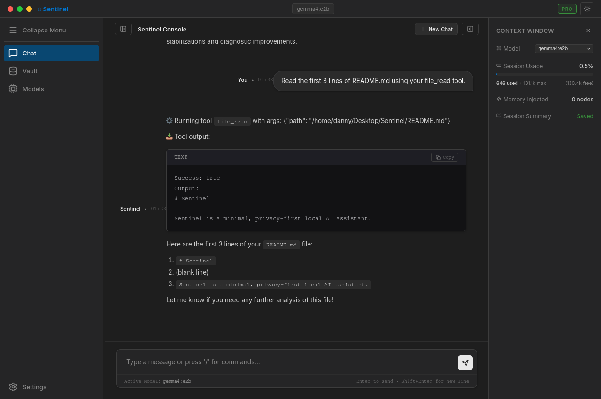
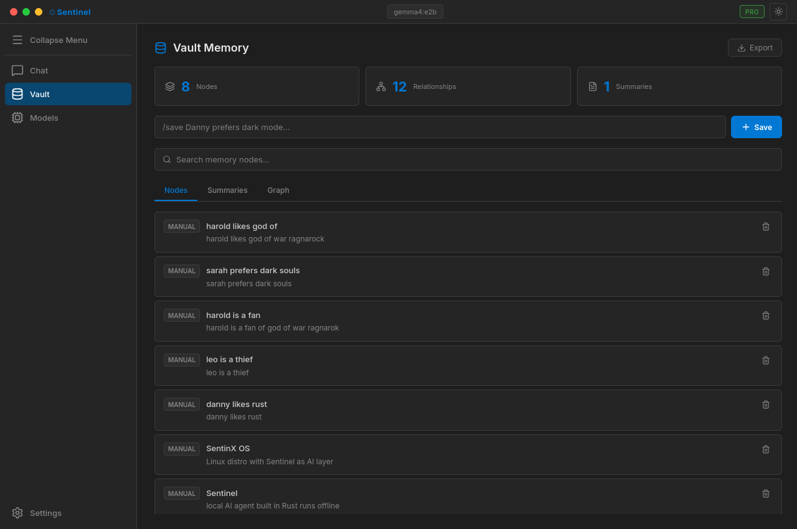
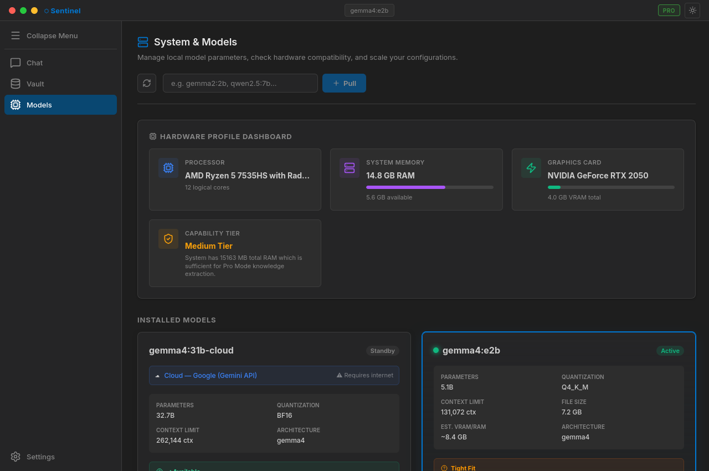

# Sentinel

> Local-first AI agent for Linux desktops. Private. Fast. Yours.


## Preview

> Screenshots coming soon — testing on Arch Linux + XFCE

<!-- 
  To add screenshots later:
  1. Run Sentinel on Linux
  2. Take screenshots with: scrot screenshots/chat.png
  3. Replace the lines below with actual images
-->

<!--



-->

---

Sentinel is a minimal, privacy-first AI assistant that runs entirely
on your Linux machine using local Ollama models.
No cloud. No tracking. No subscriptions.

---

## Features

- Chat with local AI models via Ollama
- Vault memory system (Lite and Pro modes)
- Guardian resource monitor (CPU / RAM / GPU / Temperature)
- Super+Space global hotkey (open anywhere)
- System tray integration
- Telegram bridge (/chat, /status, /memory, /model)
- Skill plugin system
- Context window management for low-spec hardware
- Works on 4GB RAM with gemma:2b

---

## Requirements

- Linux (Arch, Ubuntu, Fedora, Debian, Mint)
- [Ollama](https://ollama.ai) installed and running
- Rust 1.70+
- Node.js 18+

---

## Quick Start

### Arch Linux
```bash
sudo pacman -S ollama nodejs npm xdotool libnotify
```

### Ubuntu / Debian
```bash
sudo apt install nodejs npm xdotool libnotify-bin
curl -fsSL https://ollama.ai/install.sh | sh
```

### Fedora
```bash
sudo dnf install ollama nodejs npm xdotool libnotify
```

### Build and Install
```bash
git clone https://github.com/DannySoundarajD/Sentinel.git
cd Sentinel
cargo build --release
bash install.sh
```

### Run
```bash
ollama serve &
sentinel-launch
```

---

## Usage

| Action | How |
|--------|-----|
| Open Sentinel | Super + Space |
| Hide Sentinel | Super + Space again |
| Pull a model | Models tab → type model name → Pull |
| Save a memory | Type /save in chat |
| Search memory | Memory tab → search bar |
| View resource usage | Guardian tab |

---

## Memory System — Vault

Sentinel uses a purpose-built memory system called **Vault**.
It is fundamentally different from how memory works in ZeroClaw,
OpenClaw, and Hermes Agent.

---

### How Other Systems Handle Memory

**ZeroClaw**
- Memory is owned by the agent runtime itself
- Uses Qdrant vector database (requires a running server)
- Uses embedding models to generate vectors for every memory
- Every query does a vector similarity search
- Minimum requirements: 500MB+ just for the memory subsystem
- Requires PostgreSQL or Qdrant running as separate services
- Complex setup — multiple processes needed before agent starts

**OpenClaw**
- Similar vector-first approach
- Memory retrieval depends on embedding quality
- If embedding model is wrong or missing, retrieval breaks entirely
- No concept of memory priority or budget
- Injects everything it finds into context with no size limit
- On small models (2K context): context overflow causes silent truncation
  or hallucination

**Hermes Agent**
- Session-based memory only
- No persistence across restarts by default
- Relies on external Redis or vector store for persistence
- No awareness of model context window size
- Memory and model are tightly coupled —
  changing the model breaks the memory retrieval

---

### How Vault Works Differently

Vault is built on three principles that the above systems ignore:

**1. The model does not own memory. Vault does.**

In ZeroClaw and Hermes, memory is part of the agent runtime.
If you switch models, memory behavior changes.
In Sentinel, Vault is completely separate from the model.
You can swap Ollama models freely — Vault never changes.

**2. No vector database. No embedding model. No external services.**

Vault uses SQLite only. It runs in the same process as the backend.
Zero extra services to install or manage.
On a 4GB RAM laptop, this matters enormously.

| System        | Memory Backend       | Extra Services Needed      |
|---------------|---------------------|---------------------------|
| ZeroClaw      | Qdrant (vector DB)  | Qdrant server + embeddings |
| OpenClaw      | Vector store        | Embedding model required   |
| Hermes        | Redis / vector      | Redis server               |
| **Sentinel**  | **SQLite (Vault)**  | **None**                   |

**3. Context budget awareness.**

Every system above injects memory into context without checking
if it will fit. On a model with 2048 tokens, this silently breaks things.

Vault knows the context window of the active model before it builds context.
It assembles memory in strict priority order and stops when the budget runs out.

---

### Vault Priority System

Before every prompt Vault runs this assembly in order.
Lower priority layers are dropped automatically if context is full.

```
Priority 1 — Current user prompt         (never dropped)
Priority 2 — User preferences            (tiny, almost always fits)
Priority 3 — Recent chat (last 6 turns)  (trimmed from front if needed)
Priority 4 — Relevant memory nodes       (top 3 by keyword match)
Priority 5 — Conversation summary        (most recent, truncated)
Priority 6 — Workflow context            (dropped first if tight)
```

On a model with 2048 token context window, the math looks like this:

```
Total context:      2048 tokens
System reserve:      200 tokens  (instructions)
Response reserve:    512 tokens  (model reply space)
Available for Vault: 1336 tokens

Allocated:
User prompt:        ~50 tokens  (depends on message)
Preferences:        ~80 tokens
Recent history:    ~600 tokens  (last 6 turns, trimmed)
Memory nodes:      ~300 tokens  (3 nodes × 100 tokens each)
Summary:           ~200 tokens  (truncated to fit)
Remaining:         ~106 tokens  (buffer)
```

The model never sees a context it cannot handle.
No silent truncation. No hallucination from overflow.

---

### Vault Modes

**Lite Mode** — for 4 to 8GB RAM

Designed for daily use on modest hardware.

- Fresh session by default — no automatic memory injection
- Memory only stored when you use /save
- Memory only retrieved when you use /frommemory
- Zero overhead — raw prompt goes straight to Ollama
- Works on models as small as tinyllama:1.1b (2048 tokens)

```
User types: /save Danny prefers dark mode
Vault stores: key="Danny prefers dark mode" in SQLite

Later session:
User types: /frommemory preferences
Vault retrieves and injects matching nodes into next prompt
```

**Pro Mode** — for 16GB+ RAM

Designed for power users who want persistent context across sessions.

- After every conversation Vault extracts key entities automatically
- Builds a graph of nodes and relationships in SQLite
- Before every prompt searches the graph for relevant context
- Assembles and injects context within the token budget
- Conversation summaries stored and retrieved automatically

```
Graph example after a week of use:

DannySoundarajD
├── works on → SentinX OS
├── prefers → dark mode, Arch Linux, XFCE
├── building → Sentinel, SecureCall, AI SoleMate
└── uses → gemma:2b, phi3:mini

Before next prompt about "SentinX":
Vault finds: SentinX node + relationships + past summary
Injects only what fits in the token budget
Model receives rich context without overflow
```

---

### Database Schema

Everything lives in a single SQLite file at:
`~/.local/share/sentinx/sentinel/vault.db`

```sql
-- Memory graph nodes
CREATE TABLE memory_nodes (
    id          INTEGER PRIMARY KEY,
    name        TEXT NOT NULL UNIQUE,
    type        TEXT NOT NULL,
    description TEXT
);

-- Relationships between nodes
CREATE TABLE memory_edges (
    id        INTEGER PRIMARY KEY,
    source_id INTEGER REFERENCES memory_nodes(id),
    target_id INTEGER REFERENCES memory_nodes(id),
    relation  TEXT NOT NULL,
    weight    REAL DEFAULT 1.0
);

-- Conversation summaries
CREATE TABLE conversation_summaries (
    id        INTEGER PRIMARY KEY,
    title     TEXT,
    summary   TEXT NOT NULL,
    timestamp INTEGER NOT NULL
);

-- User preferences
CREATE TABLE preferences (
    key   TEXT PRIMARY KEY,
    value TEXT NOT NULL
);

-- Chat history (persists across restarts)
CREATE TABLE chat_history (
    id        TEXT PRIMARY KEY,
    role      TEXT NOT NULL,
    content   TEXT NOT NULL,
    timestamp INTEGER NOT NULL
);
```

No Qdrant. No Redis. No PostgreSQL. No embedding server.
One file. Always available. Instant startup.

---

### Why This Matters on Low-Spec Hardware

A typical ZeroClaw or OpenClaw setup on a 4GB laptop:

```
Qdrant server:        ~300 MB RAM
Embedding model:      ~500 MB RAM
Agent runtime:        ~200 MB RAM
Ollama + model:      ~1600 MB RAM
Total:               ~2600 MB RAM  →  system starts swapping
```

Sentinel on the same 4GB laptop:

```
Sentinel daemon:       ~30 MB RAM
Ollama + gemma:2b:  ~1600 MB RAM
Total:              ~1630 MB RAM  →  970 MB still free
```

Vault adds zero meaningful overhead because SQLite
runs inside the Sentinel process with no separate service.

---

### Vault vs Others — Summary Table

| Feature                        | ZeroClaw | OpenClaw | Hermes | Sentinel Vault |
|-------------------------------|----------|----------|--------|----------------|
| Persistent memory             | ✅       | ✅       | ⚠️     | ✅             |
| Survives model switch         | ❌       | ❌       | ❌     | ✅             |
| Works without extra services  | ❌       | ❌       | ❌     | ✅             |
| Context window awareness      | ❌       | ❌       | ❌     | ✅             |
| Works on 4GB RAM              | ❌       | ❌       | ⚠️     | ✅             |
| Manual memory control         | ❌       | ❌       | ⚠️     | ✅ (/save)     |
| Graph relationships           | ✅       | ✅       | ❌     | ✅ (Pro mode)  |
| Zero config setup             | ❌       | ❌       | ❌     | ✅             |
| Offline capable               | ✅       | ✅       | ⚠️     | ✅             |

⚠️ = partial or requires specific configuration

---

## Model Recommendations

| RAM    | Model          | Context Tokens |
|--------|----------------|----------------|
| 4 GB   | gemma:2b       | 4096           |
| 8 GB   | phi3:mini      | 4096           |
| 16 GB  | mistral:7b     | 8192           |
| 32 GB  | mixtral:8x7b   | 16384          |

---

## Architecture

```
User
  ↓
Electron UI  (React + Vite)
  ↓
Rust API     (Axum on :8888)
  ├── /chat        SSE streaming
  ├── /runtime     Ollama model management
  ├── /vault       SQLite memory
  └── /guardian    System metrics
  ↓
Ollama       (localhost:11434)
```

---

## Project Structure

```
Sentinel/
├── src/                  Rust backend
│   ├── api/              25 HTTP endpoints
│   ├── vault/            Memory system + token budget
│   ├── runtime/          Ollama integration
│   ├── guardian/         Resource monitoring
│   ├── bridge/           Telegram bot
│   ├── hotkey/           Super+Space
│   └── notifications/    Desktop notifications
├── sentinel-ui/          Electron + React frontend
│   ├── electron/         Main process + preload
│   └── src/pages/        Chat, Models, Guardian, Memory, Skills, Settings
├── install.sh            Auto-installer
└── README.md
```

---

## License

MIT — see [LICENSE](LICENSE)

---

## Credits

Sentinel is built on top of the architectural foundation of
[ZeroClaw](https://github.com/openagen/zeroclaw), an open-source
autonomous agent runtime written in Rust by the OpenAgen team.

ZeroClaw provided the initial module structure, trait-driven architecture,
and Rust workspace configuration that Sentinel was transformed from
into a local-first Linux desktop AI application.

Thank you to the ZeroClaw contributors for their open-source work.

*Sentinel is not affiliated with or endorsed by the ZeroClaw project.*
